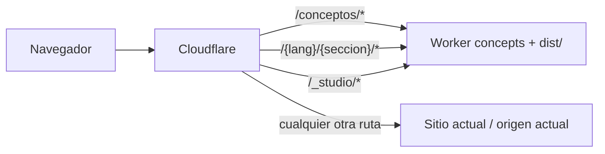

# Despliegue de `concepts` en Cloudflare

Esta guía describe el despliegue de este repositorio como una aplicación estática independiente que se monta dentro de dos sitios existentes:

- Español: `https://www.jjlmoya.es/conceptos/`.
- Otros catorce idiomas: `https://www.gamebob.dev/{idioma}/{seccion-traducida}/`.

No se sustituye la raíz de ninguno de los dos dominios. El despliegue debe hacerse con **Cloudflare Workers Static Assets y rutas de Worker**, no asignando un dominio completo a un proyecto de Pages.

## 1. Resultado esperado



Una única compilación de Astro contiene todas las rutas. Cloudflare solo decide en qué URLs se ejecuta el Worker. No hay SSR, API, KV, D1 ni variables de entorno de runtime.

Estado comprobado del repositorio el 19 de julio de 2026:

- Node requerido: `>=22.18.0 <23`.
- Astro: salida `static`, con barra final obligatoria.
- 45 páginas HTML generadas.
- 63 ficheros en `dist`, unos 7,6 MB en total; el mayor mide unos 450 KB.
- 95 tests pasan.
- `check`, ESLint, Stylelint, Prettier, Vitest y `astro build` pasan localmente.
- `npm audit` no terminó en la comprobación local porque el entorno no tenía acceso al endpoint de npm; debe pasar en CI con red.

## 2. Por qué usar un Worker con Static Assets

El proyecto no es una SPA y no necesita adaptar Astro a SSR. Cloudflare puede subir directamente `dist` como Static Assets y resolver archivos como `conceptos/index.html` o `en/concepts/measurement/index.html`.

Las rutas de Worker permiten montar esos archivos solo en prefijos concretos y dejar que el resto de cada dominio continúe en el origen actual. Esto es lo que hace que el proyecto se comporte como una especie de microfrontend desplegable por separado.

No usar:

- Un Custom Domain para `www.jjlmoya.es` o `www.gamebob.dev`: convertiría el Worker en el origen del hostname completo.
- `not_found_handling: "single-page-application"`: devolvería `index.html` con HTTP 200 para rutas inexistentes y ocultaría errores reales.
- Una ruta global `www.gamebob.dev/*` con lógica de proxy, salvo que se acepte explícitamente poner todo el sitio detrás de este Worker.
- Workers Sites: Cloudflare lo considera legado para proyectos nuevos; Static Assets es la opción actual.

## 3. Prerrequisitos de Cloudflare

Antes de tocar producción:

1. Las zonas `jjlmoya.es` y `gamebob.dev` deben estar en la **misma cuenta de Cloudflare**. Un Worker pertenece a una cuenta; si cada zona está en una cuenta distinta habrá que desplegar dos Workers o mover una zona.
2. Los registros DNS de `www.jjlmoya.es` y `www.gamebob.dev` deben existir y estar proxificados por Cloudflare, con la nube naranja.
3. Los sitios actuales deben responder correctamente antes del cambio. Guardar como control al menos estas URLs:
    - `https://www.jjlmoya.es/`
    - `https://www.jjlmoya.es/utilidades/`
    - `https://www.gamebob.dev/en/`
    - `https://www.gamebob.dev/en/utilities/`
4. Revisar en **Workers & Pages > Domains & Routes** que otro Worker no tenga rutas más específicas sobre los prefijos que se enumeran abajo.
5. Tener un subdominio `workers.dev` activo para la cuenta o habilitar expresamente `preview_urls`.

## 4. Dos bloqueos que hay que resolver antes de automatizar

### 4.1. Dependencia local `@jjlmoya/identity`

`package.json` declara actualmente:

```json
"@jjlmoya/identity": "file:../identity"
```

Funciona en el equipo de desarrollo porque existen los directorios hermanos `concepts` e `identity`. Un runner que solo clone `Game-Bob/concepts` no tendrá `../identity`, por lo que `npm ci` no es reproducible en esa situación.

La solución preferida a medio plazo es publicar `@jjlmoya/identity@0.2.0` en npm y sustituir la referencia local por la versión exacta:

```json
"@jjlmoya/identity": "0.2.0"
```

Después se debe regenerar y confirmar `package-lock.json`.

Mientras no esté publicado, CI debe clonar ambos repositorios como hermanos:

```yaml
- name: Checkout concepts
  uses: actions/checkout@v4
  with:
      path: concepts

- name: Checkout identity
  uses: actions/checkout@v4
  with:
      repository: Game-Bob/identity
      ref: <tag-o-sha-inmutable>
      path: identity
```

Es importante fijar `identity` a un tag o SHA compatible, no a una rama móvil. Con esos paths, `concepts/../identity` resuelve correctamente.

La corrección se aplica tanto al job de calidad ya existente como al futuro job de despliegue. No debe activarse CD mientras el job `quality` no pase en GitHub desde un checkout limpio.

### 4.2. Propiedad de `/_studio/*`

Astro genera ahora los CSS y las fuentes con URLs absolutas bajo `/_studio/`. Por tanto, el Worker necesita estas dos rutas adicionales:

- `www.jjlmoya.es/_studio/*`
- `www.gamebob.dev/_studio/*`

Eso entrega a `concepts` la propiedad completa de `/_studio/*` en ambos hosts. En este momento los sitios padre usan `/_astro/*`, así que los espacios están separados. Antes de desplegar un segundo microfrontend que también use `/_studio`, hay que elegir una de estas opciones:

- Reservar un subespacio por proyecto, por ejemplo `/_studio/concepts/*`, cambiando `build.assets` en Astro.
- Crear un único proyecto agregador que publique todos los ficheros de `/_studio`.

No se deben apuntar dos Workers diferentes al mismo patrón `/_studio/*`: una petición solo puede terminar en uno de ellos.

## 5. Preparar Wrangler

Añadir Wrangler como dependencia de desarrollo y confirmar la versión exacta que quede en el lockfile:

```bash
npm install --save-dev wrangler
```

Scripts recomendados para `package.json`:

```json
{
    "scripts": {
        "cf:dry-run": "wrangler deploy --dry-run",
        "cf:preview": "wrangler versions upload --preview-alias staging",
        "cf:deploy": "wrangler deploy",
        "cf:deployments": "wrangler deployments list",
        "cf:rollback": "wrangler rollback"
    }
}
```

Crear `wrangler.jsonc` como fuente de verdad. Cloudflare recomienda JSONC para proyectos nuevos:

```jsonc
{
    "$schema": "./node_modules/wrangler/config-schema.json",
    "name": "gamebob-concepts",
    "compatibility_date": "2026-07-19",
    "workers_dev": false,
    "preview_urls": true,
    "routes": [
        { "pattern": "www.jjlmoya.es/conceptos", "zone_name": "jjlmoya.es" },
        { "pattern": "www.jjlmoya.es/conceptos/*", "zone_name": "jjlmoya.es" },
        { "pattern": "www.jjlmoya.es/_studio/*", "zone_name": "jjlmoya.es" },

        { "pattern": "www.gamebob.dev/en/concepts", "zone_name": "gamebob.dev" },
        { "pattern": "www.gamebob.dev/en/concepts/*", "zone_name": "gamebob.dev" },
        { "pattern": "www.gamebob.dev/fr/concepts", "zone_name": "gamebob.dev" },
        { "pattern": "www.gamebob.dev/fr/concepts/*", "zone_name": "gamebob.dev" },
        { "pattern": "www.gamebob.dev/de/konzepte", "zone_name": "gamebob.dev" },
        { "pattern": "www.gamebob.dev/de/konzepte/*", "zone_name": "gamebob.dev" },
        { "pattern": "www.gamebob.dev/it/concetti", "zone_name": "gamebob.dev" },
        { "pattern": "www.gamebob.dev/it/concetti/*", "zone_name": "gamebob.dev" },
        { "pattern": "www.gamebob.dev/pt/conceitos", "zone_name": "gamebob.dev" },
        { "pattern": "www.gamebob.dev/pt/conceitos/*", "zone_name": "gamebob.dev" },
        { "pattern": "www.gamebob.dev/nl/concepten", "zone_name": "gamebob.dev" },
        { "pattern": "www.gamebob.dev/nl/concepten/*", "zone_name": "gamebob.dev" },
        { "pattern": "www.gamebob.dev/sv/koncept", "zone_name": "gamebob.dev" },
        { "pattern": "www.gamebob.dev/sv/koncept/*", "zone_name": "gamebob.dev" },
        { "pattern": "www.gamebob.dev/pl/koncepcje", "zone_name": "gamebob.dev" },
        { "pattern": "www.gamebob.dev/pl/koncepcje/*", "zone_name": "gamebob.dev" },
        { "pattern": "www.gamebob.dev/id/konsep", "zone_name": "gamebob.dev" },
        { "pattern": "www.gamebob.dev/id/konsep/*", "zone_name": "gamebob.dev" },
        { "pattern": "www.gamebob.dev/tr/kavramlar", "zone_name": "gamebob.dev" },
        { "pattern": "www.gamebob.dev/tr/kavramlar/*", "zone_name": "gamebob.dev" },
        { "pattern": "www.gamebob.dev/ru/концепции", "zone_name": "gamebob.dev" },
        { "pattern": "www.gamebob.dev/ru/концепции/*", "zone_name": "gamebob.dev" },
        { "pattern": "www.gamebob.dev/ja/コンセプト", "zone_name": "gamebob.dev" },
        { "pattern": "www.gamebob.dev/ja/コンセプト/*", "zone_name": "gamebob.dev" },
        { "pattern": "www.gamebob.dev/ko/콘셉트", "zone_name": "gamebob.dev" },
        { "pattern": "www.gamebob.dev/ko/콘셉트/*", "zone_name": "gamebob.dev" },
        { "pattern": "www.gamebob.dev/zh/概念", "zone_name": "gamebob.dev" },
        { "pattern": "www.gamebob.dev/zh/概念/*", "zone_name": "gamebob.dev" },

        { "pattern": "www.gamebob.dev/_studio/*", "zone_name": "gamebob.dev" },
    ],
    "assets": {
        "directory": "./dist",
        "html_handling": "force-trailing-slash",
    },
}
```

La ruta exacta sin barra permite que Cloudflare encuentre el HTML y responda con la redirección de barra final. La ruta acabada en `/*` sirve el índice, todas las obras y las peticiones que lleven query string. Una petición no canónica como `/en/concepts?x=1` no coincide con ninguno de los patrones sin sobrecapturar otras secciones; si se necesita cubrirla, se debe añadir una Redirect Rule de zona que convierta el path exacto sin barra a su versión con barra conservando la query.

Las rutas Unicode de ruso, japonés, coreano y chino deben probarse expresamente en la primera subida. Mantener `wrangler.jsonc` en UTF-8 y no reemplazar esos slugs por transliteraciones: deben coincidir con los directorios reales de `dist` y con las canonicals.

No se define `main`, porque no hace falta código de Worker. No se define fallback SPA. Una ruta inexistente dentro de estos prefijos debe producir 404.

### Evitar que configuración y código diverjan

Los slugs de sección viven en `src/i18n/sections.ts`, pero Wrangler necesita rutas estáticas. Conviene añadir un test que lea `wrangler.jsonc`, elimine comentarios y compruebe que para cada idioma hay una ruta exacta y otra con `/*`, derivadas de `CONCEPTS_SECTION_SLUGS`. Así, cambiar una traducción romperá CI antes de dejar producción inaccesible.

## 6. Cabeceras y caché

Crear `public/_headers`; Astro lo copiará a `dist/_headers`. Como punto de partida:

```text
/*
  X-Content-Type-Options: nosniff
  Referrer-Policy: strict-origin-when-cross-origin
  Strict-Transport-Security: max-age=31536000; includeSubDomains
  Content-Security-Policy: default-src 'self'; base-uri 'self'; object-src 'none'; frame-ancestors 'self'; form-action 'self'; img-src 'self' data: blob:; font-src 'self' data:; style-src 'self' 'unsafe-inline'; script-src 'self' 'unsafe-inline'; connect-src 'self'; media-src 'self'; worker-src 'self' blob:; upgrade-insecure-requests

/_studio/*
  Cache-Control: public, max-age=31536000, immutable
```

Los nombres de `/_studio` incluyen hash, por lo que pueden cachearse de forma inmutable. El HTML debe revalidarse. Antes de publicar la CSP, probar todas las interacciones; el repositorio usa scripts inline, por eso el punto de partida permite `'unsafe-inline'`.

No se declara `Cache-Control` en la regla general porque Static Assets ya envía por defecto `public, max-age=0, must-revalidate`. Si se declarase también ahí, la regla más específica de `/_studio/*` heredaría los dos valores en vez de sustituir limpiamente el general.

## 7. Primera publicación manual

La primera publicación no debe salir automáticamente al hacer merge. Hacerla desde un árbol limpio y con una persona observando ambos dominios.

### 7.1. Validación local

En PowerShell usar `npm.cmd` si la política de ejecución bloquea `npm.ps1`:

```powershell
npm.cmd ci
npm.cmd run qa
git status --short
```

`qa` debe terminar completamente, incluido `npm audit`. Después:

```powershell
npm.cmd run build
npx.cmd wrangler deploy --dry-run
```

Comprobar que `dist` contiene:

```text
dist/conceptos/index.html
dist/en/concepts/index.html
dist/ru/концепции/index.html
dist/ja/コンセプト/index.html
dist/ko/콘셉트/index.html
dist/zh/概念/index.html
dist/_studio/*
```

### 7.2. Autenticación local

```powershell
npx.cmd wrangler login
npx.cmd wrangler whoami
```

Verificar que `whoami` muestra la cuenta que contiene **las dos zonas**.

### 7.3. Preview sin tráfico de producción

```powershell
npx.cmd wrangler versions upload --preview-alias staging
```

Wrangler devolverá una URL parecida a:

```text
https://staging-gamebob-concepts.<subdominio>.workers.dev
```

Probar en esa URL como mínimo:

- `/conceptos/`
- `/conceptos/medicion/`
- `/en/concepts/measurement/`
- `/fr/concepts/mesure/`
- `/ru/концепции/izmerenie/`
- `/ja/コンセプト/measurement/`
- `/ko/콘셉트/measurement/`
- `/zh/概念/measurement/`
- Una URL inexistente, que debe responder 404.
- Un CSS y una fuente bajo `/_studio/`.

El HTML de preview conservará las canonicals de producción; es correcto y evita indexar una identidad alternativa. Si la preview queda pública de forma permanente, protegerla con Cloudflare Access o desactivar el alias tras las pruebas.

### 7.4. Activación

Justo antes de desplegar, guardar el ID de la versión activa si ya existe:

```powershell
npx.cmd wrangler deployments list
```

Activar producción:

```powershell
npx.cmd wrangler deploy
```

No modificar rutas manualmente en el dashboard después: en el siguiente deploy, Wrangler vuelve a tratar `wrangler.jsonc` como fuente de verdad.

## 8. Smoke test inmediato en producción

### 8.1. Rutas que debe servir `concepts`

```powershell
curl.exe -I https://www.jjlmoya.es/conceptos/
curl.exe -I https://www.jjlmoya.es/conceptos/medicion/
curl.exe -I https://www.gamebob.dev/en/concepts/
curl.exe -I https://www.gamebob.dev/de/konzepte/messung/
curl.exe -I https://www.gamebob.dev/ru/концепции/izmerenie/
curl.exe -I https://www.gamebob.dev/ja/コンセプト/measurement/
curl.exe -I https://www.gamebob.dev/ko/콘셉트/measurement/
curl.exe -I https://www.gamebob.dev/zh/概念/measurement/
```

Esperar HTTP 200. Comprobar también que una URL sin barra recibe una redirección temporal a la versión con barra y que una obra inexistente devuelve 404.

Abrir una página en el navegador, localizar una URL real de CSS en el HTML y verificar:

```powershell
curl.exe -I "https://www.jjlmoya.es/_studio/<fichero-con-hash>.css"
curl.exe -I "https://www.gamebob.dev/_studio/<fichero-con-hash>.css"
```

Debe responder 200 en ambos hosts. Si se añadió `_headers`, el asset debe incluir `Cache-Control: public, max-age=31536000, immutable`.

### 8.2. Rutas que no debe alterar

```powershell
curl.exe -I https://www.jjlmoya.es/
curl.exe -I https://www.jjlmoya.es/utilidades/
curl.exe -I https://www.gamebob.dev/en/
curl.exe -I https://www.gamebob.dev/en/utilities/
```

Comparar status, `content-type`, redirecciones y contenido con los controles previos. Estas URLs deben seguir llegando al despliegue padre.

### 8.3. SEO y navegación

En una página española y otra internacional confirmar:

- Canonical apunta al host y path correctos.
- Existen los quince `hreflang` recíprocos.
- No aparece `noindex`.
- Selector de idioma navega entre los dos hosts.
- Cabecera, menú móvil, tema y pie funcionan.
- No hay 404 de CSS o fuentes en la consola de red.

## 9. Automatización con GitHub Actions

Solo después de completar con éxito la primera publicación manual. Crear un Environment de GitHub llamado `production` y añadir:

- `CLOUDFLARE_ACCOUNT_ID` como secret o variable.
- `CLOUDFLARE_API_TOKEN` como secret.

Crear un token personalizado con el mínimo alcance posible:

- Permiso para editar Workers Scripts en la cuenta elegida.
- Permiso para editar Workers Routes en las zonas `jjlmoya.es` y `gamebob.dev`.
- Recursos limitados a esa cuenta y esas dos zonas.

No guardar el token en `.env`, `.dev.vars`, el workflow ni el repositorio.

Ejemplo de job que se puede añadir al workflow actual después de `quality`. Este ejemplo mantiene el checkout hermano de `identity`:

```yaml
deploy:
    if: github.event_name == 'push' && github.ref == 'refs/heads/main'
    needs: quality
    runs-on: ubuntu-latest
    environment: production
    permissions:
        contents: read

    steps:
        - name: Checkout concepts
          uses: actions/checkout@v4
          with:
              path: concepts

        - name: Checkout identity
          uses: actions/checkout@v4
          with:
              repository: Game-Bob/identity
              ref: <tag-o-sha-inmutable>
              path: identity

        - name: Setup Node
          uses: actions/setup-node@v4
          with:
              node-version: 22.18.0
              cache: npm
              cache-dependency-path: concepts/package-lock.json

        - name: Install
          working-directory: concepts
          run: npm ci

        - name: Build
          working-directory: concepts
          run: npm run build

        - name: Deploy
          uses: cloudflare/wrangler-action@v3
          with:
              apiToken: ${{ secrets.CLOUDFLARE_API_TOKEN }}
              accountId: ${{ secrets.CLOUDFLARE_ACCOUNT_ID }}
              workingDirectory: concepts
              command: deploy
```

El job `quality` ya ejecuta `npm run qa`; `deploy` depende de él y vuelve a generar `dist` desde el mismo commit. Mantener aprobación manual en el Environment durante los primeros despliegues. Más adelante se puede retirar, pero nunca eliminar `needs: quality`.

Para pull requests, una mejora posterior es ejecutar `wrangler versions upload` y publicar la URL de preview sin promoverla. No mezclar esa mejora con la primera salida a producción.

## 10. Rollback

Si falla contenido, CSS o JavaScript pero las rutas son correctas:

```powershell
npx.cmd wrangler deployments list
npx.cmd wrangler rollback <version-id-estable>
```

También se puede hacer desde **Workers & Pages > gamebob-concepts > Deployments > … > Rollback**. El rollback activa inmediatamente la versión elegida sobre todas las rutas del Worker.

Si el problema son las propias rutas —por ejemplo, `/_studio/*` pertenecía a otro proyecto— un rollback de versión no basta, porque las rutas continúan asignadas. En ese caso:

1. Restaurar inmediatamente las rutas anteriores en el dashboard o corregir `wrangler.jsonc` y desplegar.
2. Repetir los controles de las rutas padre.
3. No borrar el Worker hasta haber retirado o reasignado sus rutas.

## 11. Mantenimiento

Cada vez que se añada un idioma, se cambie un slug de sección o se cambie `build.assets`:

1. Actualizar el contrato de rutas en el código.
2. Actualizar `wrangler.jsonc`.
3. Actualizar el test de sincronización de rutas.
4. Ejecutar `npm run qa`.
5. Probar la versión con preview.
6. Desplegar y repetir el smoke test de la ruta afectada.

Revisar periódicamente:

- Historial de Deployments y posibilidad real de rollback.
- Errores 404 bajo las rutas de conceptos y `/_studio`.
- Caducidad y alcance del API token.
- Límites de Workers Static Assets. Este proyecto está muy por debajo del límite actual del plan Free de 20.000 ficheros y 25 MiB por fichero, pero debe volverse a comprobar si se incorporan imágenes o vídeos pesados.

## 12. Orden de ejecución recomendado

1. Resolver el checkout/publicación de `identity` y conseguir CI verde desde cero.
2. Confirmar que `/_studio/*` queda reservado a `concepts`.
3. Añadir Wrangler, `wrangler.jsonc`, `_headers` y el test que sincroniza rutas.
4. Crear el token y los secrets con alcance mínimo.
5. Ejecutar QA y dry-run.
6. Subir una versión con alias `staging` y completar la matriz de preview.
7. Desplegar manualmente.
8. Ejecutar smoke tests de rutas propias y rutas padre.
9. Mantener observación y rollback preparado.
10. Activar el job automático, inicialmente protegido por aprobación del Environment.

## Referencias oficiales

- [Cloudflare Workers Static Assets](https://developers.cloudflare.com/workers/static-assets/)
- [Servir una aplicación desde un subdirectorio](https://developers.cloudflare.com/workers/static-assets/routing/advanced/serving-a-subdirectory/)
- [Rutas de Workers y reglas de coincidencia](https://developers.cloudflare.com/workers/configuration/routing/routes/)
- [Configuración de Wrangler](https://developers.cloudflare.com/workers/wrangler/configuration/)
- [Tratamiento de HTML y barras finales](https://developers.cloudflare.com/workers/static-assets/routing/advanced/html-handling/)
- [Cabeceras personalizadas para Static Assets](https://developers.cloudflare.com/workers/static-assets/headers/)
- [Preview URLs y `versions upload`](https://developers.cloudflare.com/workers/versions-and-deployments/preview-urls/)
- [GitHub Actions para Workers](https://developers.cloudflare.com/workers/ci-cd/external-cicd/github-actions/)
- [Rollback de Workers](https://developers.cloudflare.com/workers/versions-and-deployments/rollbacks/)
- [Límites de Workers](https://developers.cloudflare.com/workers/platform/limits/)
- [Configuración `build.assets` de Astro](https://docs.astro.build/en/reference/configuration-reference/#buildassets)
